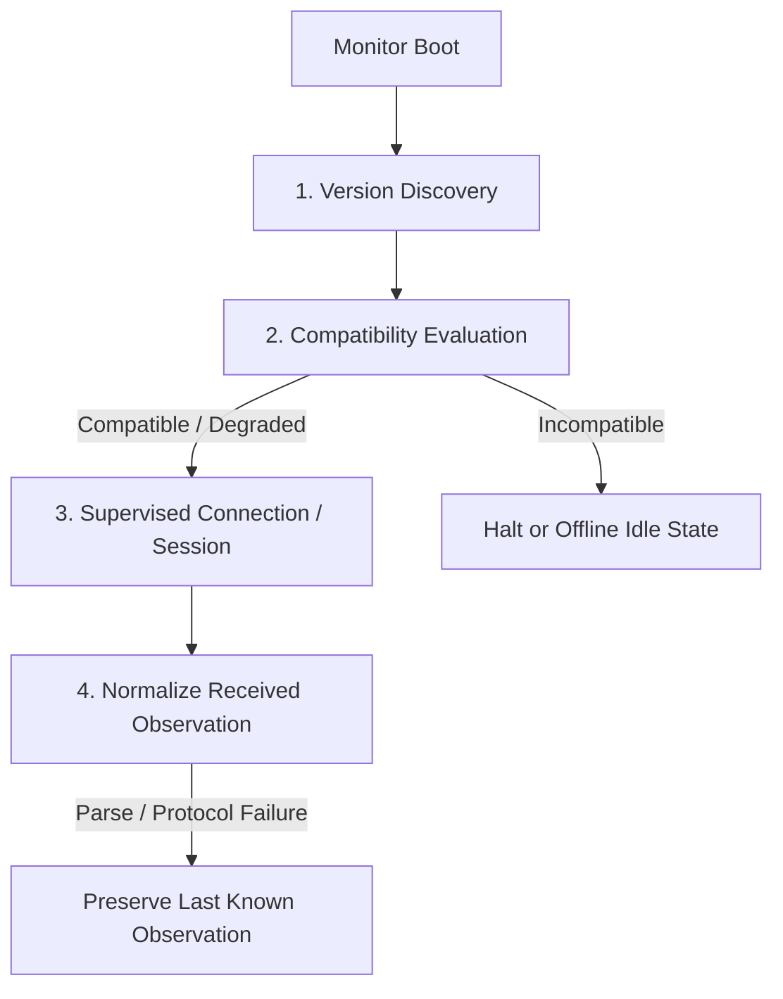

# Capacity Observatory Public Boundary Contract

This document specifies the public API contract exposed by `Shoestring.Harness.Capacity`
for downstream monitor implementations (`CodexMonitor` in Work Package B and
`ClaudeMonitor` in Work Package C).

Downstream monitors must call this boundary exclusively for compatibility checks,
version discovery, payload normalization, and failure handling. Neither monitor
should implement custom compatibility logic or ad-hoc JSON parsing.

## Downstream Monitor Lifecycle

Each provider monitor process follows a 4-phase lifecycle:



### Phase 1: CLI Version Discovery

On startup, the monitor discovers the installed CLI version via the injectable command runner:

```elixir
case Shoestring.Harness.Capacity.discover_version(:codex) do
  {:ok, %{raw: raw_version, version: semver}} ->
    # e.g. %{raw: "codex-cli 0.150.1", version: "0.150.1"}
    ...

  {:error, :not_found} ->
    # Executable not found on PATH
    ...

  {:error, {:command_failed, status, snippet}} ->
    # Exit status non-zero
    ...
end
```

In unit tests, an injected runner must be passed via `opts[:runner]` (e.g. a mock module
or function) so that tests run completely offline without installed CLIs or network access.

### Phase 2: Compatibility Evaluation

Before establishing transport or subscribing to updates, evaluate the compatibility
of the provider, observation mode, and discovered version against the authoritative
Gate 0A support matrix:

```elixir
compat = Shoestring.Harness.Capacity.compatibility(:codex, :app_server_stdio, version)
```

The resulting map contains:
* `:provider` - `:codex` or `:claude`
* `:invocation_mode` - `:app_server_stdio`, `:interactive_status_line`, etc.
* `:support_tier` - `:proactive`, `:conservative_partial`, or `:unsupported`
* `:compatibility_state` - `:compatible`, `:degraded`, or `:incompatible`
* `:version` - normalized semver string or `nil`
* `:reason` - bounded explanation string if degraded or incompatible (`nil` when compatible)

#### Compatibility Policy Rules:
1. **Tested version match** (`0.150.1` for Codex, `2.1.251` for Claude):
   * Codex: `:proactive` tier, `:compatible` outcome.
   * Claude: `:conservative_partial` tier, `:compatible` outcome.
2. **Untested version drift** (e.g. `0.151.0` or `3.0.0`):
   * Outcome degrades to `:degraded` with reason `"untested_cli_version: <version>"`.
   * Future automatic admission policies will safely fail closed on degraded compatibility.
3. **Unsupported modes** (Claude headless `-p --output-format json`, `stream-json`, terminal scraping):
   * Outcome is `:incompatible`, tier is `:unsupported`.

### Phase 3: Observation Normalization

When a monitor receives a structured provider message (such as a JSON-RPC read response,
an `account/rateLimits/updated` notification, or a Claude `statusLine` callback), it
normalizes the raw payload into a versioned `Shoestring.Harness.CapacitySnapshot`:

```elixir
{:ok, snapshot} =
  Shoestring.Harness.Capacity.normalize(
    :codex,
    :app_server_stdio,
    raw_payload,
    version: discovered_version,
    captured_at: DateTime.utc_now(),
    source_event: :explicit_read, # or :update_notification / :status_line_input
    scope: "subscription",
    last_known_snapshot: state.last_known_snapshot
  )
```

#### Normalization Semantics:
* **Additive unknown fields:** Tolerated without error. Unknown vendor JSON keys are ignored.
* **Missing required fields:** Missing rate-limit containers or windows degrade or reject
  with bounded reasons (`"no_valid_windows"`, `"missing_window: secondary"`).
* **Malformed values:** Invalid numbers, negative percentages, or bad types become
  `:unknown` or `:degraded` with explicit reasons; they **never** fabricate zero usage.
* **Refusal indicators:** Vendor rate-limit reached indicators yield `:refused` state
  with `:low` confidence.
* **Freshness & Stale windows:** Observations older than 300 seconds automatically degrade
  to `:stale_observation` with `:low` confidence. Future timestamps fail closed as `:unknown`.

### Phase 4: Preserving Last-Known Observations on Protocol Failure

If a transport disconnects, a socket closes, or a raw payload cannot be parsed, the monitor
must **never** overwrite last-known capacity with fabricated zero usage. Instead, it must
call `preserve_last_known/3`:

```elixir
{:ok, degraded_snapshot} =
  Shoestring.Harness.Capacity.preserve_last_known(
    state.last_known_snapshot,
    "stdio_connection_closed",
    now: DateTime.utc_now()
  )
```

This preserves the previous observation's windows and original `observed_at` timestamp
while updating the state to `:degraded` with `:low` confidence and an explicit diagnostic reason.
