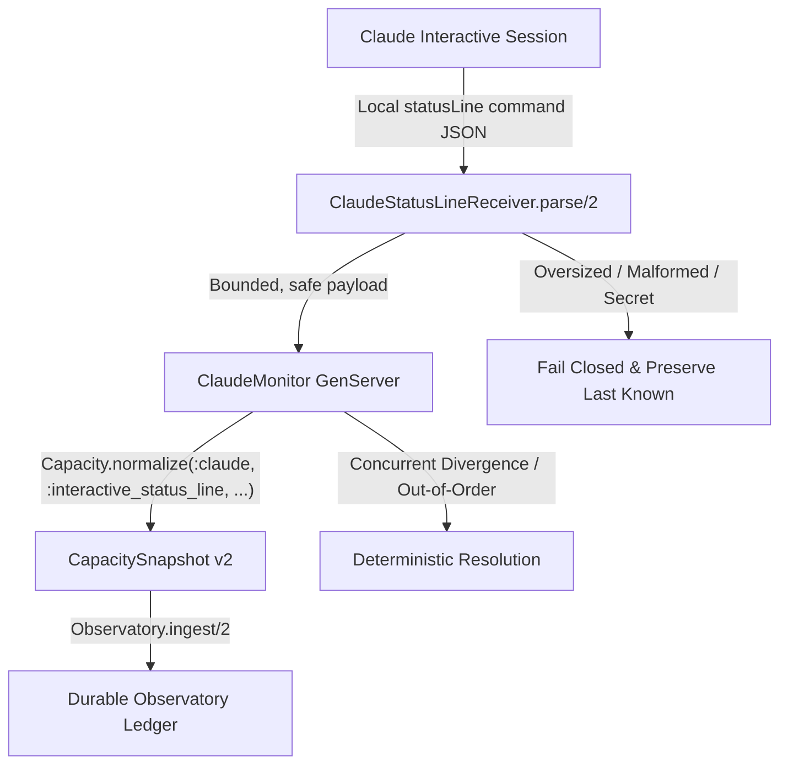

# Claude Production Capacity Monitor & StatusLine Receiver

This document specifies the design, lifecycle, and public contracts of the
Claude production capacity source (`Shoestring.Harness.Capacity.ClaudeMonitor`)
and its passive statusLine receiver boundary (`Shoestring.Harness.Capacity.ClaudeStatusLineReceiver`).

## Architecture & Locked Policy

The Claude capacity source operates strictly as a **passive, response-driven observer**:



### Locked Policy Rules
1. **Passive observation only:** The monitor never executes `claude` CLI commands to refresh capacity, run synthetic prompts, or consume model turns.
2. **No headless or scraped modes:** Claude `-p --output-format json`, `stream-json`, and terminal scraping are classified as `:unsupported` and fail closed.
3. **Local statusLine delivery:** Telemetry is accepted strictly via local interactive `statusLine` command callbacks delivered through the injectable receiver/input boundary.

---

## StatusLine Receiver Boundary

Module: `Shoestring.Harness.Capacity.ClaudeStatusLineReceiver`

The receiver boundary sits between raw external callbacks and the monitor GenServer. It enforces strict bounding and safety:

- **Payload size limits:** Binary payloads exceeding 64KB (65,536 bytes) are rejected immediately with `{:error, :payload_oversized}`.
- **Structural bounds:** Max map size of 64 keys, max nesting depth of 10 levels, and list limits of 128 items prevent resource exhaustion.
- **Secret & content scanning:** Rejects payloads containing authentication tokens (`Bearer ...`, `sk-...`, `api_key`, `password`) or forbidden conversation keys (`raw_transcript`, `prompt_messages`, `messages`, `response_text`).
- **Independent window parsing:** Validates `five_hour` and `seven_day` rate-limit windows independently (`used_percentage` within `[0.0, 100.0]`, valid `resets_at` epoch or ISO8601 string).
- **First-response boundary:** Validates that absent `rate_limits` containers before the first usable response are safely recognized without error.

---

## ClaudeMonitor GenServer

Modules:
- `Shoestring.Harness.Capacity.ClaudeMonitor` (Primary GenServer)
- `Shoestring.Harness.ClaudeMonitor` (Convenience boundary delegating to `Capacity.ClaudeMonitor`)

Implements: `Shoestring.Harness.Capacity.Source`

### Public API

```elixir
alias Shoestring.Harness.Capacity.ClaudeMonitor

# Start supervised monitor
{:ok, pid} = ClaudeMonitor.start_link(
  version: "2.1.251",
  scope: "subscription",
  clock: Shoestring.Harness.SystemClock,
  sink: Shoestring.Harness.Observatory
)

# Ingest passive statusLine callback
{:ok, :persisted, snapshot} = ClaudeMonitor.receive_status_line(payload)

# Query current snapshot evaluated against clock
{:ok, snapshot} = ClaudeMonitor.current_snapshot()

# Query comprehensive diagnostic status
status = ClaudeMonitor.status()
scoped_status = ClaudeMonitor.status(pid, scope: "team-a")

# Signal session disconnect (preserves last-known data in degraded state)
{:ok, degraded_snapshot} =
  ClaudeMonitor.disconnect(pid, "session_exited", scope: "team-a")

# Source behavior implementations
{:ok, snapshot} = ClaudeMonitor.observe()
provenance = ClaudeMonitor.provenance()
# => %{adapter_id: "claude_interactive_status_line", provider_id: "claude", ...}
tier = ClaudeMonitor.support_tier()
# => :conservative_partial
```

### Observation Lifecycle and Invariants

1. **Pre-first-response boundary:**
   Before the first usable model turn emits rate limits, the monitor reports:
   - `capacity_state: :unknown`
   - `support_tier: :conservative_partial`
   - `confidence: :none`
   - `reason: "rate_limits_absent_before_first_response_or_unsupported_subscription"`
   - `windows: []`
   - `eligible?: false`

2. **Partial window degraded state:**
   If Claude returns only one window (e.g. `five_hour` is present but `seven_day` is absent):
   - The missing window is `:unknown` with `used_percent: nil`. It is **never** 0%, unlimited, or fully available.
   - The snapshot state is `:degraded` with `confidence: :medium` and reason `"partial_window_observation"`.

3. **Complete window conservative-partial state:**
   When both windows are observed:
   - `capacity_state: :degraded` (conservative/partial tier).
   - `confidence: :medium` (never elevated to `:high`).
   - `reason: "conservative_partial_observation"`.
   - `eligible?: false` (conservative sources never auto-admit proactive leases).

4. **Concurrent sessions and scope isolation:**
   - Interleaved callbacks with distinct scopes (e.g. `scope: "team-a"` and `scope: "team-b"`) are tracked in separate scope partitions and never conflated.
   - Within the same scope, multiple concurrent sessions reporting divergent window percentages are detected: confidence degrades to `:low`, capacity degrades to `:degraded`, and reason records `"concurrent_session_divergence"`.

5. **Deterministic duplicate and out-of-order handling:**
   - Duplicate callbacks (same timestamp and window data) return `{:ok, :deduplicated, snapshot}` and do not grow the ledger.
   - Out-of-order callbacks (older `captured_at` than current recorded state) return `{:ok, :out_of_order, current_snapshot}` without regressing the newer observation.

6. **Preservation of last-known data upon failure:**
   - If malformed input, oversized payloads, JSON parse failures, transport disconnects, or sink errors occur after real observations have accumulated, `Capacity.preserve_last_known/3` preserves the previous window percentages in a `:degraded` state with `:low` confidence. No 0% usage is ever fabricated.
   - When the sink recovers on subsequent callbacks, monitor status automatically returns to `:ok`.

---

## Offline Test Verification

All tests run completely offline without real Claude CLI processes or network access:
- `test/shoestring/harness/capacity/claude_status_line_receiver_test.exs`
- `test/shoestring/harness/capacity/claude_monitor_test.exs`
