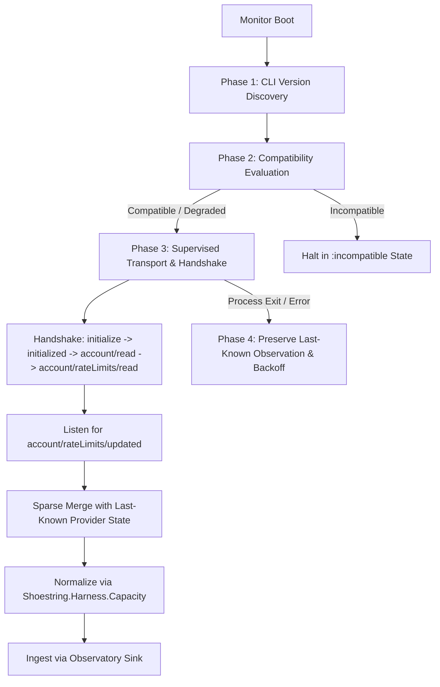

# Codex Capacity Monitor

This document describes the production Codex capacity monitoring subsystem introduced
in Iteration 3 Work Package B.

## Overview

`Shoestring.Harness.Capacity.CodexMonitor` is a supervised GenServer that maintains a
bidirectional JSON-RPC connection to `codex app-server --stdio` without shell interpolation.
It observes account capacity limits, handles sparse push notifications, normalizes raw
payloads into canonical `CapacitySnapshot` v2 structures, and ingests them into the
`Shoestring.Harness.Observatory` ledger.

## Architecture & Phased Lifecycle

### Phase 1: CLI Version Discovery & Compatibility

On initialization, the monitor discovers the installed CLI version via injectable
`Shoestring.Harness.Capacity.discover_version/2`. The version is evaluated against the
Gate 0A support matrix via `Shoestring.Harness.Capacity.compatibility/3`:
- Tested version `0.150.1`: `:compatible` outcome, `:proactive` support tier.
- Untested versions (e.g. `0.151.0`): degrades to `:degraded` with diagnostic reason
  `"untested_cli_version: <version>"`, failing closed.
- Missing executable or incompatible mode: halts in `:incompatible` state.

### Phase 2: Supervised Stdio Transport

The production transport `Shoestring.Harness.Capacity.Codex.StdioTransport` launches
`codex app-server --stdio` via Erlang's `Port.open({:spawn_executable, exec_path}, ...)`
without shell interpolation.
- **Line Framing:** Enforces a maximum frame size of 256 KB (`262_144` bytes). Oversized
  frames are safely rejected without memory exhaustion.
- **Message Framing:** Handles CRLF/LF line endings safely.
- **Crash Recovery:** Monitors the port and process exits, notifying the monitor on closure.

### Phase 3: Protocol Handshake Sequence

Once transport is established:
1. `{"jsonrpc": "2.0", "id": 1, "method": "initialize", "params": {"clientInfo": ...}}`
2. Discards sensitive environment paths (`codexHome`, user agents) from the initialize result.
3. Sends `{"jsonrpc": "2.0", "method": "initialized", "params": {}}` notification.
4. Sends `{"jsonrpc": "2.0", "id": 2, "method": "account/read", "params": {"refreshToken": false}}`.
5. Checks authentication status: if `requiresOpenaiAuth: true` with missing account or unauthenticated
   status, transitions status to `:auth_required`.
6. Sends `{"jsonrpc": "2.0", "id": 3, "method": "account/rateLimits/read", "params": {}}`.
7. Merges and normalizes the rate limits into the initial `CapacitySnapshot`.

### Phase 4: Sparse Update Merge & Preservation

Codex push notifications (`account/rateLimits/updated`) are sparse: they frequently omit
the secondary window, reset credits, or spend control metadata.

`CodexMonitor.merge_provider_state/2`:
- Merges updated window values (`usedPercent`, `resetsAt`) without erasing omitted windows.
- Retains existing secondary window if omitted in a sparse update.
- Retains provider metadata (`planType`, `rateLimitResetCredits`) if omitted.
- Feeds merged payload into `Shoestring.Harness.Capacity.normalize/4`.
- On transport disconnect or parse failure, calls `Capacity.preserve_last_known/3` so known
  windows are never zeroed out or fabricated.

### Phase 5: Reconnection & Bounded Exponential Backoff

When the transport process exits or errors:
- Cancels pending request timers.
- Preserves the last-known observation with `:degraded` capacity state.
- Enters explicit `:backoff` status.
- Exponential backoff: $T = \min(\text{base} \times 2^{\text{attempt} - 1}, \text{max})$, with full random jitter.
  Defaults: `base_backoff_ms: 1_000`, `max_backoff_ms: 30_000`.
- Injected seams (`:backoff_fn`, `:random_fn`, `:clock`, `:sink`) allow deterministic offline tests.

## Explicit Statuses

`CodexMonitor.status/1` returns one of 6 explicit states:
- `:connected` - Transport connected, handshake succeeded, observation fresh and valid.
- `:disconnected` - Transport stopped or before initial connection.
- `:backoff` - Disconnected / process exited, waiting to reconnect with backoff timer.
- `:auth_required` - Codex CLI requires login or ChatGPT authentication.
- `:degraded` - Untested version drift, quota refusal reported, parse failure, or sink error.
- `:incompatible` - CLI executable missing or incompatible mode.

## Public Monitor API

- `start_link(opts \\ [])` - Starts the GenServer under supervision.
- `status(server \\ __MODULE__)` - Returns current explicit status atom.
- `last_observation(server \\ __MODULE__)` - Returns latest `CapacitySnapshot.t()` or `nil`.
- `get_status(server \\ __MODULE__)` - Returns detailed diagnostic state map.
- `read_capacity(server \\ __MODULE__, timeout \\ 5_000)` - Explicit synchronous rate-limit read.
- `disconnect(server \\ __MODULE__)` - Administrative disconnect.
- `reconnect(server \\ __MODULE__)` - Administrative reconnect.
- `observe(opts \\ %{})` - Implements `Shoestring.Harness.Capacity.Source` behaviour.
- `provenance()` - Returns `%{adapter_id: "codex_app_server_stdio", provider_id: "codex", ...}`.
- `support_tier()` - Returns `:proactive`.
